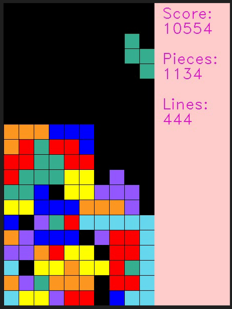

# Intelligence-Tetris

## Description



In this project, we are trying to train an Game Agent which use GNN-based Model as Encoder and use DQN as Agent training model for Tetris. The Environment of this game is based on https://github.com/uvipen/Tetris-deep-Q-learning-pytorch whose game environment is shown as above.

## How to Run

In order to train your personal model, firstly, you should go to ./Models/Parameters/hyper/gnn_hyper.yaml to change the hyper parameters of your model. Also, you can change the hyper parameters for the Game Agent in ./Models/Parameters/hyper/agent_hyper.yaml. Then you can run your model with the code showing below.

```shell
$ python train.py
```

What's more, you can use the following command to monitor the training status with tensorboard

```shell
$ tensorboard --logdir=./Models/runs/ port=6006
```

## Project Structure

```python
project
|   __init__.py
|   train.py                                   ## training script
|   environment.txt                            ## project environment
|-- Games                                      ## Game related files
|   |   __init__.py
|   |   tetris.py                              ## game environment
|-- Logger
|   |   __init__.py
|   |   Logger.py                              ## Logger for training information
|-- Models
|   |-- Layers                                 ## customized basic Layers
|       |   __init__.py
|   |-- Modules                                ## modules which is composed by different layers
|   |   |   __init__.py
|   |   |   PatchEmbedding.py                  ## module for spliting the screen matrix into patches
|   |-- Parameters                             ## Parameters including model parameters, model hyper parameters, and agent hyper parameters
|   |   |   __init__.py
|   |   |   xxxx.pth                           ## trained models' weights
|   |   |   hyper                              ## hyperparameters
|   |   |   |   agent_hyper.yaml               ## agent's hyperparameters
|   |   |   |   gnn_hyper.yaml                 ## GNN-based Game State Encoder's hyperparameters for this project
|   |-- utils                                  ## public tools
|   |   |   __init__.py                        ## including optimizers and schedules generation function named build_optimizer
|   |   |   dataset.py                         ## customized dataset object class
|   |   |   optimizers.py                      ## Lookahead Optimizer from https://arxiv.org/abs/1907.08610
|   |   |   tensorboard_handler.py             ## tensorboard handler for training visulization
|   |   |   time_handler.py                    ## time handler for calculating time consumption
|   |-- Wrappers                               ## model wrappers which is composed by different modules and layers
|   |   |   __init__.py
|   |   |   Wrapper.py                         ## father class of all wrappers
|   |   |   GNNWrapper.py                      ## Wrapper Class of GNN-based Game State Encoder for this project
```

## Hyper Parameters Explanation

### agent_hyper.yaml

agent's hyperparameters are shown as below which includes **mem_size** for the memory size of the agent, **discount** for the discount parameter of reinforcement learning, **epsilon** for the upper limit of the random coefficient, **epsilon_min** for the lower limit of the random coefficient, **epsilon_stop_episode** which describes the episode when the epsilon stop decreasing, and **replay_start_size** which describes condition when the agent should start to train.

```yaml
mem_size: 30000
discount: 0.99
epsilon: 1
epsilon_min: 1.0e-3
epsilon_stop_episode: 2000
replay_start_size: 3000
```

### gnn_hyper.yaml

model's hyperparameters are shown as below which includes **wrapper_name** which describes the wrapper you want to use as the encoder for the agent, **train_params** for hyperparameters of training, **optimizer_params** for hyperparameters of optimizer and scheduler, and **model_params** for hyperparameters of the GNN-based Game State Encoder.

```yaml
wrapper_name: GATv2Wrapper
game_mode: matrix
train_params:
    device: cuda:0
    epochs: 1 ## epoch for trainings
    episodes: 5000 ## times to play
    batch_size: 512
    max_steps:  ## step to play, None means play until the game over.
    render_every: 
    render_delay: False
    log_every: 20
    save_every: 20
optimizer_params:
    opt: adam
    lr: 0.001
    weight_decay: 0.0001
    lookahead: False
    opt_scheduler: none
    opt_decay_step: 1
    milestones: [5, 10, 15, 20, 25]
    gamma: 0.995
model_params:
    in_channels: 1
    out_channels: 1
    heads: 3
    model_name: gatv2
    model_type: gnn
    dropout: 0.2
    negative_slope: 0.2
    parameters_path: ./Models/Parameters/
    bias: True
    add_self_loop: True
    positional_embedding: True
    img_size: [20, 10]
    patch_size: [2 ,2]
    embed_dim: 32
    layers: 3
    pooling: set2set
```

## Build your own Model

To be continued. 
